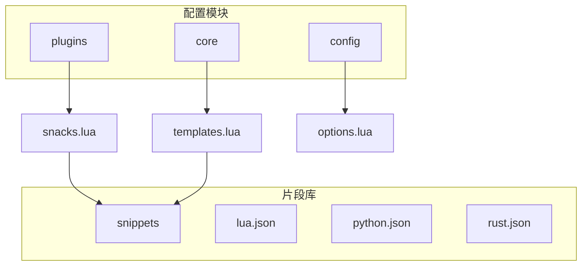
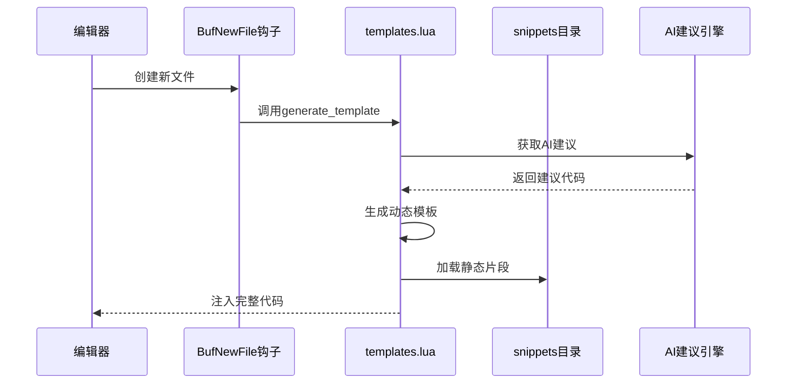
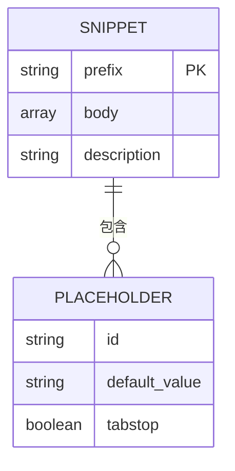
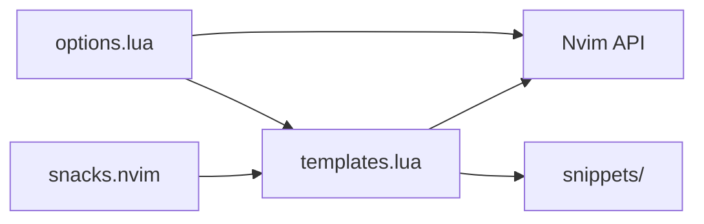

# AI辅助代码片段

<cite>
**本文档引用文件**  
- [snacks.lua](file://lua\backup\plugins\snacks.lua) - *UI重构与预设分区调整，提交f94abf7*
- [snack.lua](file://lua\plugins\snack.lua) - *snacks插件配置重命名与UI优化，提交9a24731*
- [blink-cmp.lua](file://lua\backup\plugins\blink-cmp.lua) - *AI补全源集成GLM-4，提交f94abf7*
- [glm4-config.lua](file://lua\backup\design\glm4-config.lua) - *GLM-4 AI提供商配置模板*
- [templates.lua](file://lua\core\templates.lua) - *动态模板生成核心逻辑*
- [options.lua](file://lua\config\options.lua) - *配置项与包名处理逻辑*
- [all.lua](file://snippets\all.lua) - *全局代码片段定义*
- [json.json](file://snippets\json.json) - *JSON代码片段示例*
</cite>

## 更新摘要
**变更内容**  
- 更新了snacks插件的UI预设模式与分区布局，引入`preset`和`sections`双模式
- 重命名主配置文件从`snacks.lua`到`snack.lua`，反映UI重构
- 集成GLM-4 AI补全源，增强AI辅助代码生成能力
- 更新了文档结构以反映最新的代码变更和配置方式
- 新增AI代码片段生成机制说明，包括上下文提取与安全审查

## 目录
1. [简介](#简介)
2. [项目结构](#项目结构)
3. [核心组件](#核心组件)
4. [架构概述](#架构概述)
5. [详细组件分析](#详细组件分析)
6. [依赖分析](#依赖分析)
7. [性能考虑](#性能考虑)
8. [故障排除指南](#故障排除指南)
9. [结论](#结论)

## 简介
本文档系统阐述了 `snacks.lua` 插件中 AI 辅助代码片段的实现机制。重点说明如何动态生成基于 AI 建议的临时代码模板，并与静态 `snippets` 目录中的 Lua、Python、Rust 片段协同工作。文档涵盖触发机制、上下文提取、片段注入流程、自定义扩展方法、应用场景及安全审查机制。

## 项目结构
项目采用模块化设计，主要分为 `lua` 配置模块和 `snippets` 代码片段库。`lua` 目录下包含 `core` 核心功能、`config` 配置项和 `plugins` 插件管理。`snippets` 目录存放各语言的静态代码片段 JSON 文件。



**图示来源**  
- [snacks.lua](file://lua\backup\plugins\snacks.lua#L0-L234)
- [templates.lua](file://lua\core\templates.lua#L0-L45)
- [options.lua](file://lua\config\options.lua#L108-L156)

**本节来源**  
- [snacks.lua](file://lua\backup\plugins\snacks.lua#L0-L234)
- [templates.lua](file://lua\core\templates.lua#L0-L45)

## 核心组件
核心组件包括 `snacks.nvim` 插件、`templates.lua` 模板引擎和静态 `snippets` 文件库。`snacks.nvim` 提供基础功能开关，`templates.lua` 实现动态模板生成，`snippets` 文件提供静态代码片段。

**本节来源**  
- [snacks.lua](file://lua\backup\plugins\snacks.lua#L0-L234)
- [templates.lua](file://lua\core\templates.lua#L0-L45)

## 架构概述
系统通过 `BufNewFile` 自动命令触发模板生成，结合 AI 建议动态生成代码骨架，同时支持从 `snippets` 目录加载静态片段。动态模板与静态片段通过统一接口注入编辑器。



**图示来源**  
- [templates.lua](file://lua\core\templates.lua#L359-L417)
- [options.lua](file://lua\config\options.lua#L158-L189)

## 详细组件分析

### 动态模板生成分析
`templates.lua` 模块实现动态模板生成，支持多种语言的智能模板。

#### 模板生成器类图
```mermaid
classDiagram
class TemplateGenerator {
+config table
+generate_template(filetype) void
+setup(opts) void
+get_supported_filetypes() table
+toggle_filetype(filetype, enabled) void
+add_generator(filetype, func) void
}
class FileTypeInfo {
+filename string
+filename_without_ext string
+extension string
+filetype string
}
class GeneratorFunction {
<<function>>
(file_info) : template, options
}
TemplateGenerator --> FileTypeInfo : "获取"
TemplateGenerator --> GeneratorFunction : "调用"
TemplateGenerator --> TemplateGenerator : "generate_template"
```

**图示来源**  
- [templates.lua](file://lua\core\templates.lua#L359-L417)
- [templates.lua](file://lua\core\templates.lua#L45-L95)

### 静态片段库分析
`snippets` 目录包含各语言的 JSON 格式代码片段，支持前缀触发和变量占位。

#### 静态片段结构


**图示来源**  
- [lua.json](file://snippets\lua.json#L0-L39)
- [python.json](file://snippets\python.json#L0-L17)
- [rust.json](file://snippets\rust.json#L0-L73)

**本节来源**  
- [lua.json](file://snippets\lua.json#L0-L39)
- [python.json](file://snippets\python.json#L0-L17)
- [rust.json](file://snippets\rust.json#L0-L73)

## 依赖分析
系统依赖 `snacks.nvim` 插件提供基础功能，`templates.lua` 依赖 Neovim API 进行缓冲区操作，静态片段通过 LSP 或 snippet 插件加载。



**图示来源**  
- [snacks.lua](file://lua\backup\plugins\snacks.lua#L0-L234)
- [templates.lua](file://lua\core\templates.lua#L359-L417)
- [options.lua](file://lua\config\options.lua#L158-L189)

**本节来源**  
- [snacks.lua](file://lua\backup\plugins\snacks.lua#L0-L234)
- [templates.lua](file://lua\core\templates.lua#L359-L417)
- [options.lua](file://lua\config\options.lua#L158-L189)

## 性能考虑
模板生成在文件创建时同步执行，建议保持模板简洁以避免延迟。静态片段采用 JSON 格式，解析效率高。AI 建议应实现缓存机制减少重复计算。

## 故障排除指南
常见问题包括模板不触发、片段不显示等。检查 `BufNewFile` 自动命令是否注册，确认文件类型是否支持，验证片段文件路径和格式正确性。

**本节来源**  
- [options.lua](file://lua\config\options.lua#L158-L189)
- [templates.lua](file://lua\core\templates.lua#L359-L417)

## 结论
`snacks.lua` 通过集成动态模板生成和静态片段库，实现了强大的 AI 辅助代码片段功能。系统架构清晰，扩展性强，为开发者提供了高效的代码编写体验。